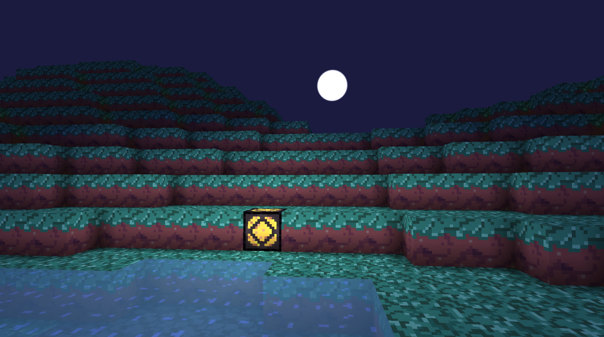

# Voxel Terrain

A technical demo of voxel world Unity implementation. Heavily relies on URP, Jobs, and Burst Compiler. 

> Implemented with Unity 2020.3.0f1

## Core Features
- Basic chunk generation
- Naive greedy meshing
- Global illumination
- Liquids

## External Dependencies
- [DI Framework](https://github.com/Delt06/di-framework)

## Further development
a.k.a. TODO:
- Decouple from DI Framework
- Persistence (allows saving worlds)
- Slabs, fences, flowers, torches, etc.
- Improve liquids meshing (by making it smooth)
- Optimize memory consumption
- Proper water/lava interaction
- Improve character controller

## Useful Links
- [Meshing algorithms comparison](https://0fps.net/2012/06/30/meshing-in-a-minecraft-game/) 
- Flood Fill Lighting algorithm: [part 1](https://www.seedofandromeda.com/blogs/29-fast-flood-fill-lighting-in-a-blocky-voxel-game-pt-1), [part 2](https://www.seedofandromeda.com/blogs/30-fast-flood-fill-lighting-in-a-blocky-voxel-game-pt-2).
- [Article series on how to work with SRP](https://catlikecoding.com/unity/tutorials/custom-srp/)